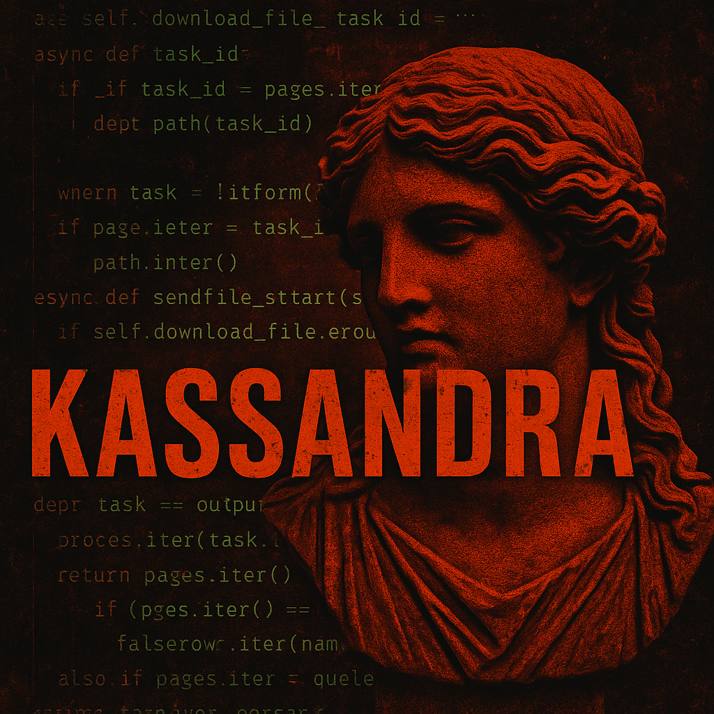

# Kassandra - Rust Mythic Agent

**Kassandra** is a custom Mythic C2 agent written in **Rust**, containerized via a **Python-based builder**. It is currently in development and includes several advanced post-exploitation and pivoting features. 


> This public release of the agent does not include all implemented obfuscation and defense evasion techniques. Several components such as advanced in-memory obfuscation, indirect syscalls, and full transport stealth—have been stripped or simplified intentionally to limit abuse and make replication harder for script kiddies. The full version remains private for controlled red team use.

<p align="center">
  
</p>

## Installation

From the Mythic install directory, use the following command to install Kassandra:
```bash
cd /path/to/Mythic
sudo ./mythic-cli install github https://github.com/PatchRequest/Kassandra
```

Or from a local folder:
```bash
sudo ./mythic-cli install folder /path/to/Kassandra
```

## ⚙ Features

* **BusyWork Evasion:**

  * Replaces all `sleep()` calls with [BusyWork](https://github.com/PatchRequest/BusyWork) — real, varied computational work (registry queries, WinAPI calls, crypto ops, memory allocation) instead of idle waiting
  * Operator-selectable intensity levels (low / medium / high / ultra) control callback frequency
  * Real program variables (UUIDs, hostnames, response bodies, file bytes, crypto tags) are fed through BusyWork via the `feed()` API, making busywork indistinguishable from real data processing
  * `churn()` calls distributed across all feature handlers (transport, checkin, tasking, file ops, execution, crypto) to break behavioral patterns at every stage

* **Syscall Evasion:**

  * `Hell's Hall` for stealthy syscall resolution

* **Security Context Control:**

  * Modify the **Security Descriptor** of the current process to restrict/allow interaction

* **Filesystem Ops:**

  * Upload / Download files
  * Enumerate directories and file attributes

* **Process Management:**

  * List running processes

* **In-Memory Execution:**

  * Execute **.NET assemblies** and **Beacon object files (BOF)** via on-demand reflective DLL loading — loader code is never in the agent binary
  * Standalone loader DLLs downloaded from C2, XOR-encrypted at rest in agent memory, reflectively loaded when needed, wiped after execution
  * BOF loader: forked [coffee-ldr](https://github.com/hakaioffsec/coffee) with renamed internals
  * .NET loader: [rustclr](https://github.com/joaoviictorti/rustclr) with `IHostAssemblyStore`-based assembly loading
  * `loadLoader` command for temporal separation of loader download and execution
  * **Built-in BOF / .NET catalog** baked into the payload container — no manual file upload needed (see below)

* **C2 Transports:**

  * **HTTP** — Standard Mythic HTTP C2 profile
  * **[S3 Storage](https://github.com/Yeeb1/awss3)** — S3-based C2 transport with AWS SigV4 signing, bootstrap registration for per-execution IAM credential isolation, and AES-256-CBC encryption with HMAC-SHA256 (EKE)
  * **[Tailscale](https://github.com/Yeeb1/mythic_tailscale)** — Embedded Tailscale/Headscale C2 transport via Go FFI, supporting HTTP and raw TCP protocols over WireGuard tunnels with optional DNS-over-HTTPS

* **Proxy & Pivot:**

  * Start a **socket proxy** tunnel via the teamserver
  * Use the agent as a **pivot endpoint** for other agents

* **Execution:**

  * Run arbitrary **PowerShell commands**

* **Reconnaissance:**

  * Take screenshots (GDI-based capture, PNG-encoded)


## 📦 Built-in BOF / .NET Catalog

Kassandra's payload container bundles a ready-to-use catalog of **188 tools** from three well-known collections, compiled at image build time:

| Source | Type | Count | Prefix |
|---|---|---|---|
| [TrustedSec CS-Situational-Awareness-BOF](https://github.com/trustedsec/CS-Situational-Awareness-BOF) | BOF | 64 | `tsec_` |
| [Outflank C2-Tool-Collection](https://github.com/outflanknl/C2-Tool-Collection) | BOF | 24 | `outflank_` |
| [Flangvik SharpCollection](https://github.com/Flangvik/SharpCollection) | .NET | 100 | `sharp_` |

The build pipeline (in the `catalog-builder` Docker stage) clones the three repos at pinned commits, compiles BOFs with `mingw-w64` and .NET tools with `dotnet-sdk-8.0`, copies precompiled SharpCollection binaries, and emits everything to `/opt/kassandra_catalog/` inside the final image. A `manifest.json` lists all available tools.

### Usage

Two new commands are available on every Kassandra callback:

**`listRemote [filter]`** — browse the catalog (runs locally on the payload container, no agent round-trip):

```
listRemote                    # show all 188 tools
listRemote kerb               # filter by substring
listRemote sharp_             # only SharpCollection entries
```

**`executeRemote -tool_name <name> [-parameters <args>]`** — run a tool from the catalog. The payload container auto-resolves the file, registers it with Mythic, and dispatches to the agent's existing `executeBOF` / `executeDOT` pipeline. No manual upload.

```
# Run a BOF (no args)
executeRemote -tool_name tsec_whoami

# BOF with typed args: str:, wstr:, int:, short:, bin: prefixes (no prefix = str)
executeRemote -tool_name outflank_kerberoast -parameters "str:CIFS/dc01.corp.local"
executeRemote -tool_name tsec_reg_query -parameters "wstr:HKLM\\SOFTWARE\\Microsoft"

# .NET assembly with space-separated argv
executeRemote -tool_name sharp_seatbelt -parameters "-group=system"
executeRemote -tool_name sharp_rubeus -parameters "kerberoast /outfile:C:\\temp\\hashes.txt"
```

The `tool_name` field in the UI modal populates dynamically from the manifest with all 188 entries.

### Rebuilding / updating the catalog

The three upstream repos are pinned via Docker build args in the `Dockerfile`:

```dockerfile
ARG TSEC_REF=ee9459cc4f42c6b025797bad22ffe8d9f1cf6487
ARG OUTFLANK_REF=e371a38c717edaf1650923575ab33bee0dd3e0ee
ARG SHARP_REF=dad01b93abf5074e72b94218b74bee310f6eb74a
```

Bump the SHAs and rebuild the payload container to pick up newer tools. Build-time errors are captured in `/opt/kassandra_catalog/build_errors.log` inside the image — a few tools are known to fail the build (e.g. old .NET-Framework-only Outflank projects), and the build continues past individual failures.

### Caveats

- **x64 only** — x86 variants are discarded at build time
- **Architecture-aware** — catalog is baked at image build, so updating tool versions requires rebuilding the payload container
- **Training / demo use** — this is intended for the public Kassandra build; operators running private deployments can disable the catalog by commenting out the `COPY --from=catalog-builder` line in the Dockerfile

## 🔧 Build Parameters

| Parameter | Type | Default | Description |
|---|---|---|---|
| `output` | exe / dll | exe | Output format |
| `chunk_size` | string | 4096 | Chunk size for upload/download |
| `busywork_intensity` | low / medium / high / ultra | medium | BusyWork evasion intensity — controls callback frequency through computational work |
| `no_console` | bool | false | Hide console window |
| `tailscale_protocol` | http / tcp | http | Transport inside WireGuard tunnel |
| `doh` | off / cloudflare / google / custom | off | DNS-over-HTTPS for Tailscale hostname resolution |

## 🔧 Notes

* **Not yet complete:**

  * Full encryption of transport and task responses


## 📁 Structure

```
/agent_code/kassandra/
├── src/
│   ├── main.rs
│   ├── transport/
│   ├── tasks/
│   └── ...
├── build.rs
└── Cargo.toml
```

## Blog Posts

This project has an accompanying blog series on [patchi.fyi](https://patchi.fyi):

- [Architecture Overview](https://patchi.fyi/blog/kassandra-architecture-overview/)
- [Hell's Hall Syscalls](https://patchi.fyi/blog/kassandra-hells-hall-syscalls/)
- [S3 Transport](https://patchi.fyi/blog/kassandra-s3-transport/)
- [In-Memory Execution](https://patchi.fyi/blog/kassandra-in-memory-execution/)
- [Process Hardening](https://patchi.fyi/blog/kassandra-process-hardening/)

## Disclaimer

This project is for **educational and red teaming** purposes only. Do not use without proper authorization.

---

Thanks to [@Yeeb1](https://github.com/Yeeb1) for contributing the [awss3](https://github.com/Yeeb1/awss3) S3 Storage C2 profile integration, the [Tailscale C2 transport](https://github.com/Yeeb1/mythic_tailscale), and agent improvements

Thanks to MalDevAcademy for their high-quality malware development training, VX-Underground for curating an essential archive of offensive research, and also to @ZkClown and Ze_Asimovitch for their continuous inspiration and contributions to the red teaming community
